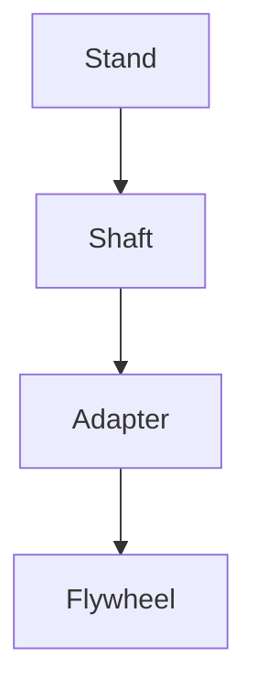

# 🎡 flywheel

[](https://github.com/futuroptimist/flywheel/actions/workflows/01-lint-format.yml)
[](https://github.com/futuroptimist/flywheel/actions/workflows/02-tests.yml)
[](https://codecov.io/gh/futuroptimist/flywheel)
[](https://github.com/futuroptimist/flywheel/actions/workflows/03-docs.yml)
[](#license)
[](https://github.com/futuroptimist/flywheel/blob/main/viewer/index.html)

**flywheel** is a GitHub template for rapid project bootstrapping. It bundles linting, testing, documentation checks, and LLM-powered agents to keep your repo healthy.

The canonical Codex automation prompt lives in [`automation.md`](docs/prompts/codex/automation.md).
Agents should review it before contributing automation to new repositories.
Other repos should copy this file to `docs/prompts/codex/automation.md`.

## Usage

1. **Use as a template** on GitHub.
2. Clone your new repo and run `./scripts/setup.sh YOURNAME NEWREPO` to personalize placeholders.
3. Commit and push to start the flywheel.
4. Review the [Codex automation prompt](docs/prompts/codex/automation.md) for baseline tasks.

## Testing

Ensure you have Node.js 20+ installed.

Run the full test suite before committing:

```bash
pre-commit run --all-files
pytest -q
npm run test:ci
python -m flywheel.fit
bash scripts/checks.sh
```

If browser dependencies are missing, run `npm run playwright:install`
or skip end-to-end tests by prefixing commands with `SKIP_E2E=1`.

The link-checking step runs `linkchecker --no-warnings README.md docs/` to
surface broken links without flooding CI logs with informational warnings.

## Contents

- CI workflows for linting, tests, and docs
- DEPENDABOT for automated dependency updates
- CodeQL workflow for security scanning
- Style guides for Python and JavaScript
- README status script handles mixed-case GitHub workflow conclusions and validates attempt counts
- Detailed best practice explanations in `docs/best_practices_catalog.md`
- Dark pattern guidance in `docs/dark-patterns.md`
- Bright pattern catalog in `docs/bright-patterns.md`
- Secret scanning helper `scripts/scan-secrets.py` that blocks common tokens in staged diffs
- README status helper (`python -m src.repo_status`) that handles mixed-case workflow conclusions and validates attempt counts
- Fast Python installs powered by [uv](https://github.com/astral-sh/uv)
- Example code and templates, including `examples/basic.py` for calling the CLI
  programmatically
- Python CLI with subcommands `init`, `update`, `audit`, `prompt`, `crawl`, and `runbook` that prompts interactively unless `--yes` is used
- RepoCrawler detects installers like uv (including `uv pip install` usage), pipx, pip/pip3, and poetry in workflows
- [AGENTS.md](AGENTS.md) detailing included LLM assistants
- [llms.txt](llms.txt) with quick context for AI helpers
- [CLAUDE.md](CLAUDE.md) summarizing Anthropic guidance
- [codex-custom-instructions.md](docs/codex-custom-instructions.md) for Codex rules
  and a [runbook.yml](runbook.yml) checklist for repo setup
- [Codex automation prompt](docs/prompts/codex/automation.md)
- CAD update prompt in `docs/prompts/codex/cad.md`
- Physics explainer prompt in `docs/prompts/codex/physics.md`
- Cross-repo prompt index in `docs/prompts/codex/summary.md` listing `prompts-items.md`, `prompts-quests.md`, and `prompts-codex.md` across repos
- Axel integration guide in `docs/axel-integration.md`
- DSPACE synergy doc in `docs/dspace-integration.md`
- Cross-repo roadmap in `docs/REPOS_ROADMAP.md`
- token.place roadmap in `docs/tokenplace-roadmap.md`
- local environment guide in `docs/local-environments.md`
- token.place features in `docs/tokenplace-features.md`
- token.place PRD in `docs/tokenplace-PRD.md`
- f2clipboard integration in `docs/f2clipboard-integration.md`
- Futuroptimist integration in `docs/futuroptimist-integration.md`
- Gabriel integration in `docs/gabriel-integration.md`
- Sigma integration in `docs/sigma-integration.md`
- Web viewer instructions in `docs/web-viewer.md`
- CI troubleshooting tips in `docs/ci-guide.md`
- Nightly STL exports are committed back to `stl/` after each run
- Sunlu spool core sleeve adapters for Bambu Lab AMS:
  [63→64 mm](./stl/spool_core_sleeve/sunlu55_to63_len60.stl) and
  [73→74 mm](./stl/spool_core_sleeve/sunlu55_to73_len60.stl) sleeves with
  matching wedge-removal cylinders
  ([63 mm](./stl/spool_core_sleeve/sunlu55_to63cyl_len60.stl) and
  [73 mm](./stl/spool_core_sleeve/sunlu55_to73cyl_len60.stl))
- Flywheel construction guide in `docs/flywheel-construction.md` with CAD files in `cad/`
  including `stand.scad`, `shaft.scad`, and `adapter.scad`. Assembly details live in `docs/flywheel-stand.md`, clamp instructions in `docs/flywheel-adapter.md`, and physics in `docs/flywheel-physics.md`

## Getting Started

```bash
# Clone your fork
git clone git@github.com:YOURNAME/NEWREPO.git
cd NEWREPO

# Personalize badge URLs and docs
./scripts/setup.sh YOURNAME NEWREPO

# Commit
git add .
git commit -m "chore: initialize flywheel"

# Install uv and pre-commit hooks
curl -Ls https://astral.sh/uv/install.sh | sh
uv venv
uv pip install pre-commit
pre-commit install

# Run checks before committing
pre-commit run --all-files
bash scripts/checks.sh
```

The script includes a spell checker powered by `codespell`. Add project-specific
terms to `dict/allow.txt` so they are not flagged as typos. VS Code users will
see the same suggestions if they install the recommended Code Spell Checker
extension. A GitHub Action runs the `typos` checker on every push to catch
misspellings that slip past local hooks.

If Playwright browser binaries are missing, install them with
`npx playwright install chromium` or skip end-to-end tests by running
`SKIP_E2E=1 bash scripts/checks.sh`.

### Embedding in an existing project

Install the CLI and inject dev tooling. Without `--yes`, the command prompts for language and whether to add dev tools:

```bash
pipx run flywheel init . --language python --save-dev --yes
```

The `--save-dev` flag copies standard workflows, linting configs,
`.pre-commit-config.yaml`, and `scripts/checks.sh` so new projects inherit the
full dev tooling out of the box.

### Updating dev tooling

Refresh CI workflows and config files in an existing repo. The command asks
whether to inject Flywheel's dev tooling; pass `--yes` to accept the defaults
non-interactively:

```bash
flywheel update path/to/repo
```

Skip copying dev tooling with `--no-save-dev` or combine it with
`--yes` for unattended runs.

### Generating Codex prompts

Invoke the prompt agent to get repo-aware suggestions:

```bash
flywheel prompt
```

README content containing `{` or `}` characters is handled safely. The command
also prints a repo snapshot that lists non-hidden files at the repository root
so prompt runners immediately see the project's structure.

### Generating repo feature summary

Create a Markdown table showing which flywheel files each repo uses:

```bash
flywheel crawl --repos-file docs/repo_list.txt --output docs/repo-feature-summary.md
```

Append `@branch` to any repo to crawl a non-default branch, e.g. `owner/name@dev`. Lines in
`docs/repo_list.txt` are combined with any repos passed on the command line. Duplicates are removed
automatically so each repository is crawled once, and when the same repo appears multiple times the
crawler keeps a single entry that honors the most recently specified branch override.
Pass `--token YOURTOKEN` or set `GITHUB_TOKEN` to avoid API rate limits.
Missing parent directories for the output path are created automatically.
The `Update Repo Feature Summary` workflow runs nightly and after each merge, committing `docs/repo-feature-summary.md` to `main` so the table stays fresh.
The summary records the short SHA of the latest commit, the name of each repository's default branch, and whether the latest commit passed CI on that branch. If CI metadata is unavailable because workflows are still running, the Trunk column shows `n/a`. API errors are treated as failures so flaky endpoints surface as `❌` instead of disappearing into the unknown state.

### Auditing dev tooling

Verify that a repository contains the expected CI workflows and config files:

```bash
flywheel audit path/to/repo
```

### Printing the runbook

View the YAML checklist defined in [`runbook.yml`](runbook.yml):

```bash
flywheel runbook
```

Override the file path with `--file path/to/runbook.yml` to inspect other repositories.

### Scanning other repositories

Clone a set of repos and generate Markdown reports:

```bash
python -m flywheel.agents.scanner
```

Reports are written to `reports/`. Each report lists only top-level non-hidden files and
ignores directories. File names are sorted case-insensitively. Existing paths under the
scanner's work area are removed before each clone so reports reflect a fresh snapshot.
Missing parent directories are created automatically when cloning.

### Refreshing Related Projects statuses

Update the `## Related Projects` list with workflow emojis:

```bash
python -m src.repo_status --readme README.md --attempts 3
```

Provide `--token` or set `GITHUB_TOKEN` to authenticate requests. The `--attempts` flag controls
how many times each workflow run is fetched to detect inconsistent API responses; values below 1
are rejected.

### Viewing the 3D flywheel

Run the bundled Flask app to explore the CAD models:

```bash
python webapp/app.py
```

Visit `http://localhost:5000` (or the port set via ``FLYWHEEL_WEBAPP_PORT``)
and watch the wheel spin in your browser. Drag the canvas to rotate the model
and use your mouse wheel to zoom in or out while you inspect details.

Alternatively, open `viewer/threejs.html` for a standalone Three.js demo that loads the STL parts and shows simple ball bearings.

### Verifying CAD fit

Install the Python requirements if you haven't already:

```bash
pip install -r requirements.txt
```

Then run the fit checker to ensure the exported STLs match the SCAD sources:

```bash
python -m flywheel.fit
```

A successful run prints:

```
All parts fit together.
```

If any measurement drifts beyond the tolerance, the checker pinpoints the
affected part and the exact deviation so you can adjust the CAD parameters or
STL exports before printing. Equality checks now include a signed ``Δ`` value
to show whether the measured feature is oversized or undersized, for example
``Δ -0.200 mm`` when a wheel bore is 0.2 mm too small.

Call ``verify_fit`` directly with a custom ``tol`` value to tighten or relax
the default ``0.1`` mm tolerance. Larger diameters use six times the supplied
``tol`` to accommodate mesh tessellation, so shrinking the tolerance also
narrows those comparisons.

Lines may include inline ``//`` comments, negative values, decimals without a
leading zero, trailing decimal points, scientific notation, and underscore digit
separators; the checker ignores the comments when parsing. Assignments must end
with a semicolon or a ``ValueError`` is raised.

Below is a simplified view of how the pieces stack:



### Regenerating CAD meshes

Re-export STL and OBJ files whenever a SCAD file changes:

```bash
scripts/build_stl.sh
python - <<'PY'
from webapp.app import ensure_obj_models
ensure_obj_models()
PY
python -m flywheel.fit
```

## License

Licensed under either of

- Apache License, Version 2.0 ([LICENSE-APACHE](LICENSE-APACHE) or
  <https://www.apache.org/licenses/LICENSE-2.0>)
- MIT license ([LICENSE-MIT](LICENSE-MIT) or
  <https://opensource.org/licenses/MIT>)

at your option.

### Contribution

Unless you explicitly state otherwise, any contribution intentionally submitted for
inclusion in the work shall be dual licensed as above, without any additional terms or
conditions.

## Values

We aim for a positive-sum, empathetic community. The flywheel embraces regenerative and open-source principles to keep energy cycling back into every project.

## Related Projects

- ✅ [Futuroptimist](https://github.com/futuroptimist/futuroptimist) –  \
  scripts and metadata for the channel.  \
  See `docs/futuroptimist-integration.md` for lessons this repo borrows and improvement ideas.
- ✅ [token.place](https://github.com/futuroptimist/token.place) –  \
  stateless faucet for LLM inference.  \
  See `docs/tokenplace-features.md` and related docs.
- ❌ [DSPACE](https://github.com/democratizedspace/dspace) –  \
  offline-first idle simulation with maker quests.  \
  See `docs/dspace-integration.md` for quest ideas.
- ✅ [flywheel](https://github.com/futuroptimist/flywheel) –  \
  boilerplate for reproducible CI and releases.
- ✅ [Gabriel](https://github.com/futuroptimist/gabriel) –  \
  "guardian angel" LLM focused on security.  \
  Its `docs/FLYWHEEL_RISK_MODEL.md` discusses how automation changes your threat model.  \
  See `docs/gabriel-integration.md` for ways these repositories will share tooling.
- ✅ [f2clipboard](https://github.com/futuroptimist/f2clipboard) –  \
  bulk-copy utility exploring macro workflows.  \
  See `docs/f2clipboard-integration.md`.
- ✅ [Axel](https://github.com/futuroptimist/axel) –  \
  personal LLM accelerator for repository quests.  \
  See `docs/axel-integration.md` for pairings.
- ✅ [Sigma](https://github.com/futuroptimist/sigma) –  \
  ESP32 "AI pin" hardware.  \
  See `docs/sigma-integration.md`.
- ✅ [gitshelves](https://github.com/futuroptimist/gitshelves) –  \
  3D-printable block models from GitHub commits.
- ✅ [wove](https://github.com/futuroptimist/wove) –  \
  toolkit for knitting and robotic looms.
- ✅ [sugarkube](https://github.com/futuroptimist/sugarkube) –  \
  k3s platform for off-grid Raspberry Pi clusters.  \
  See `docs/sugarkube-integration.md`.
- ✅ [jobbot3000](https://github.com/futuroptimist/jobbot3000) –  \\
  self-hosted job search copilot.
- ✅ [Prompt Docs Summary][pds] –  \\
  index of one-click prompts across repos.

[pds]: https://github.com/futuroptimist/flywheel/blob/main/docs/prompt-docs-summary.md

- ✅ [jobbot3000](https://github.com/futuroptimist/jobbot3000) –  \
  self-hosted, open-source job search copilot.

A summary of flywheel features adopted across repos lives in [docs/repo-feature-summary.md](docs/repo-feature-summary.md).

For automation guidelines see the [Codex prompt](docs/prompts/codex/automation.md).
