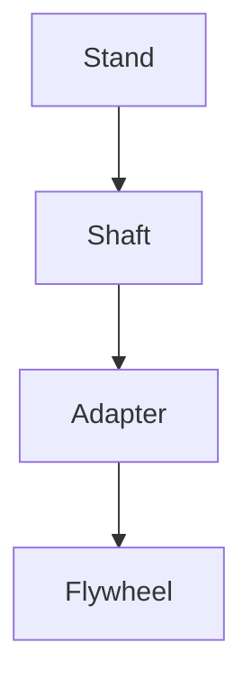

# 🎡 flywheel

[](https://github.com/futuroptimist/flywheel/actions/workflows/01-lint-format.yml)
[](https://github.com/futuroptimist/flywheel/actions/workflows/02-tests.yml)
[](https://codecov.io/gh/futuroptimist/flywheel)
[](https://github.com/futuroptimist/flywheel/actions/workflows/03-docs.yml)
[](LICENSE)
[](https://github.com/futuroptimist/flywheel/blob/main/viewer/index.html)

**flywheel** is a GitHub template for rapid project bootstrapping. It bundles linting, testing, documentation checks, and LLM-powered agents to keep your repo healthy.

## Usage

1. **Use as a template** on GitHub.
2. Clone your new repo and run `./scripts/setup.sh YOURNAME NEWREPO` to personalize placeholders.
3. Commit and push to start the flywheel.

## Contents

- CI workflows for linting, tests, and docs
- DEPENDABOT for automated dependency updates
- CodeQL workflow for security scanning
- Style guides for Python and JavaScript
- Detailed best practice explanations in `docs/best_practices_catalog.md`
- Dark pattern guidance in `docs/dark-patterns.md`
- Bright pattern catalog in `docs/bright-patterns.md`
- Fast Python installs powered by [uv](https://github.com/astral-sh/uv)
- Example code and templates
- Python CLI with subcommands `init`, `update`, `audit`, `prompt`, and `crawl` that prompts interactively unless `--yes` is used
- [AGENTS.md](AGENTS.md) detailing included LLM assistants
- [llms.txt](llms.txt) with quick context for AI helpers
- [CLAUDE.md](CLAUDE.md) summarizing Anthropic guidance
- [codex-custom-instructions.md](docs/codex-custom-instructions.md) for Codex rules
  and a [runbook.yml](runbook.yml) checklist for repo setup
- Codex automation prompt in `docs/prompts-codex.md`
- CAD update prompt in `docs/prompts-codex-cad.md`
- Physics explainer prompt in `docs/prompts-codex-physics.md`
- Cross-repo prompt index in `docs/prompt-docs-summary.md` listing `prompts-items.md`, `prompts-quests.md`, and `prompts-codex.md` across repos
- Axel integration guide in `docs/axel-integration.md`
- DSPACE synergy doc in `docs/dspace-integration.md`
- token.place roadmap in `docs/tokenplace-roadmap.md`
- local environment guide in `docs/local-environments.md`
- token.place features in `docs/tokenplace-features.md`
- token.place PRD in `docs/tokenplace-PRD.md`
- f2clipboard integration in `docs/f2clipboard-integration.md`
- Futuroptimist integration in `docs/futuroptimist-integration.md`
- Gabriel integration in `docs/gabriel-integration.md`
- Sigma integration in `docs/sigma-integration.md`
- Web viewer instructions in `docs/web-viewer.md`
- CI troubleshooting tips in `docs/ci-guide.md`
- Nightly STL exports are committed back to `stl/` after each run
- Flywheel construction guide in `docs/flywheel-construction.md` with CAD files in `cad/`
  including `stand.scad`, `shaft.scad`, and `adapter.scad`. Assembly details live in `docs/flywheel-stand.md`, clamp instructions in `docs/flywheel-adapter.md`, and physics in `docs/flywheel-physics.md`

## Getting Started

```bash
# Clone your fork
git clone git@github.com:YOURNAME/NEWREPO.git
cd NEWREPO

# Personalize badge URLs and docs
./scripts/setup.sh YOURNAME NEWREPO

# Commit
git add .
git commit -m "chore: initialize flywheel"

# Install uv and pre-commit hooks
curl -Ls https://astral.sh/uv/install.sh | sh
uv venv
uv pip install pre-commit
pre-commit install

# Run checks before committing
bash scripts/checks.sh
```

The script includes a spell checker powered by `codespell`. Add project-specific
terms to `dict/allow.txt` so they are not flagged as typos. VS Code users will
see the same suggestions if they install the recommended Code Spell Checker
extension. A GitHub Action runs the `typos` checker on every push to catch
misspellings that slip past local hooks.

### Embedding in an existing project

Install the CLI and inject dev tooling. Without `--yes`, the command prompts for language and whether to add dev tools:

```bash
pipx run flywheel init . --language python --save-dev --yes
```

### Generating Codex prompts

Invoke the prompt agent to get repo-aware suggestions:

```bash
flywheel prompt
```

### Generating repo feature summary

Create a Markdown table showing which flywheel files each repo uses:

```bash
flywheel crawl --repos-file docs/repo_list.txt --output docs/repo-feature-summary.md
```

Append `@branch` to any repo to crawl a non-default branch, e.g. `owner/name@dev`. Lines in `docs/repo_list.txt` are combined with any repos passed on the command line.
Pass `--token YOURTOKEN` or set `GITHUB_TOKEN` to avoid API rate limits.
The `Update Repo Feature Summary` workflow commits `docs/repo-feature-summary.md` to `main` after each merge.
The summary records the short SHA of the latest commit, the name of each repository's default branch, and whether the latest commit passed CI on that branch.

### Auditing dev tooling

Verify that a repository contains the expected CI workflows and config files:

```bash
flywheel audit path/to/repo
```

### Scanning other repositories

Clone a set of repos and generate Markdown reports:

```bash
python -m flywheel.agents.scanner
```

Reports are written to `reports/`.

### Viewing the 3D flywheel

Run the bundled Flask app to explore the CAD models:

```bash
python webapp/app.py
```

Visit `http://localhost:42165` and watch the wheel spin in your browser.

Alternatively, open `viewer/threejs.html` for a standalone Three.js demo that loads the STL parts and shows simple ball bearings.

### Verifying CAD fit

Install the Python requirements if you haven't already:

```bash
pip install -r requirements.txt
```

Then run the fit checker to ensure the exported STLs match the SCAD sources:

```bash
python -m flywheel.fit
```

A successful run prints:

```
All parts fit together.
```

Below is a simplified view of how the pieces stack:



## Values

We aim for a positive-sum, empathetic community. The flywheel embraces regenerative and open-source principles to keep energy cycling back into every project.

## Related Projects

- [Axel](https://github.com/futuroptimist/axel) – personal LLM accelerator that manages goals across your repositories. See `docs/axel-integration.md` for how to pair it with flywheel.
- [Gabriel](https://github.com/futuroptimist/gabriel) – "guardian angel" LLM focused on security. Its `docs/FLYWHEEL_RISK_MODEL.md` discusses how flywheel-style automation changes your threat model. See `docs/gabriel-integration.md` for ways these repositories will share tooling and evolve together.
- [Futuroptimist](https://github.com/futuroptimist/futuroptimist) – YouTube scripts and automation experiments. See `docs/futuroptimist-integration.md` for lessons this repo borrows and improvement ideas.
- [token.place](https://github.com/futuroptimist/token.place) – stateless faucet for LLM inference. See `docs/tokenplace-features.md` and related docs.
- [DSPACE](https://github.com/democratizedspace/dspace) – offline-first idle simulation with maker quests. See `docs/dspace-integration.md` for quest ideas.
- [f2clipboard](https://github.com/futuroptimist/f2clipboard) – bulk-copy utility exploring macro workflows. See `docs/f2clipboard-integration.md`.
- [Sigma](https://github.com/futuroptimist/sigma) – ESP32 "AI pin" hardware. See `docs/sigma-integration.md`.
- [sugarkube](https://github.com/futuroptimist/sugarkube) – accessible k3s platform for Raspberry Pi devices with off-grid solar. See `docs/sugarkube-integration.md`.

A summary of flywheel features adopted across repos lives in [docs/repo-feature-summary.md](docs/repo-feature-summary.md).
