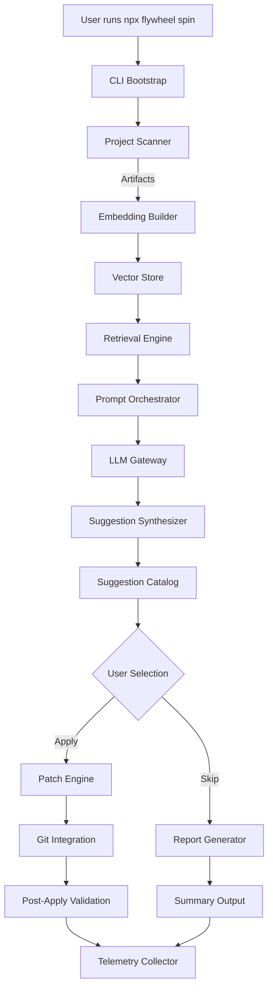
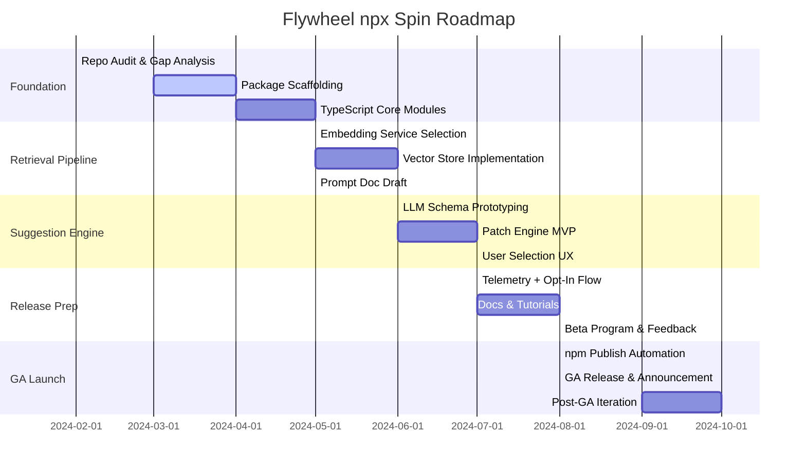

# Flywheel `npx flywheel spin` Design Doc

## Document Control
- **Author:** Auto-generated by Codex Automation Agent
- **Stakeholders:** Flywheel maintainers, Tooling Platform Team, Docs Agent, Release Drafter Bot
- **Status:** Draft
- **Last Updated:** 2025-10-07
- **Related Docs:** [`docs/prompt-docs-summary.md`](prompt-docs-summary.md), [`docs/tokenplace-PRD.md`](tokenplace-PRD.md), [`docs/patch-plan.md`](patch-plan.md), [`docs/prompts/codex/flywheel-spin.md`](prompts/codex/flywheel-spin.md)

## Executive Summary
`flywheel` currently provides repository analysis and automation helpers, but it is not yet packaged
for universal consumption via npm. This design defines the strategy and roadmap to publish Flywheel
as an npm package that exposes an `npx flywheel spin` command. The command will scan an arbitrary
project (similar to RepoCrawler), perform retrieval-augmented generation (RAG) using a configurable
LLM backend (token.place preferred when GA), and return a curated list of change proposals that the
user can review and selectively apply. The plan covers product scope, architecture, milestones,
release management, and operational readiness.

## Goals
1. **npm Distribution:** Publish Flywheel as an official npm package supporting `npx` invocation.
2. **Portable Repository Scanning:** Enable project-agnostic scanning inspired by RepoCrawler with
   language-agnostic heuristics and pluggable analyzers.
3. **RAG-Powered Suggestions:** Integrate a retrieval pipeline that feeds context to an LLM to
   generate actionable change proposals.
4. **Selective Application Flow:** Provide UX (CLI prompts + optional JSON output) for users to pick
   and apply suggested changes.
5. **Operational Excellence:** Document release, testing, telemetry, and support playbooks to keep
   trunk green and deliver continuous improvements.

## Non-Goals
- Building a hosted SaaS service; focus is on local CLI execution with optional cloud APIs.
- Replacing existing Python package distribution. Python CLI remains supported.
- Implementing a GUI. CLI output may integrate with future UI work but is not in scope.
- Shipping a proprietary LLM; the design assumes third-party APIs (token.place, OpenAI, Anthropic,
  etc.) configurable via environment variables.

## User Stories
- **Repository Maintainer:** Runs `npx flywheel spin` to get prioritized refactor suggestions,
  selects a subset, and applies patches with git integration.
- **Consultant / Flywheel Operator:** Uses advanced flags to configure analyzers, throttle LLM
  usage, and export suggestions as JSON for off-line review.
- **CI Automation:** Invokes the command in dry-run mode to generate change reports without applying
  patches, posting results to pull requests.

## Success Metrics
- Time-to-first-value < 3 minutes for new users (npm install + initial scan).
- At least 90% of CLI interactions complete without runtime errors in telemetry sampling.
- 80% user satisfaction rating in feedback prompts for suggestion relevance.
- <2% regression rate measured by failing `npm run test:ci` after automated patch application.

## Implementation Progress
- **2025-10-10:** Added a Python `flywheel spin --dry-run` subcommand that emits
  heuristic suggestions in JSON. This provides a lightweight preview while the
  npm packaging and LLM integration remain under development.
- **2025-10-11:** Tagged heuristic suggestions with `category` values so the
  dry-run output matches the prompt schema (`docs`, `fix`, `chore`).
- **2025-10-11:** Added `--format table` and `--format markdown` output modes to
  the Python dry-run CLI so it matches the format matrix described below,
  including a stats block and suggestion table for copy/paste workflows.
- **2025-10-12:** Matched the dry-run CI detection to RepoCrawler's keyword
  heuristic so deploy-only workflows no longer mask missing CI.
- **2025-10-13:** Added `flywheel config telemetry` to manage opt-in
  preferences stored under `~/.config/flywheel/config.json` with a
  `FLYWHEEL_CONFIG_DIR` override for sandboxed runs.
- **2025-10-14:** Added `--analyzers` toggles to the Python dry-run CLI so teams
  can focus on specific heuristics while the npm implementation matures.

## Architecture Overview


### Components
- **CLI Bootstrap:** Node entrypoint that resolves the package, ensures dependencies (Python
  bridge, embeddings cache), and dispatches commands.
- **Project Scanner:** Reusable module that enumerates files, extracts metadata, and builds rich
  documents for retrieval. Borrow heuristics from RepoCrawler while abstracting analyzers (AST,
  dependency graphs, metadata) as pluggable providers.
- **Embedding Builder:** Uses selected LLM embedding endpoint (token.place embeddings when GA) with
  local cache and rate limiting.
- **Vector Store:** Local disk-backed store (SQLite + pgvector-like extension via `vectordb`, or
  `chromadb` wrapper) enabling reuse across runs. Provide fallback to in-memory store for ephemeral
  runs.
- **Retrieval Engine:** Hybrid search (semantic + keyword) to gather context for prompt generation.
- **Prompt Orchestrator:** Template-driven prompts referencing prompt doc; includes conversation
  state and tool usage instructions.
- **LLM Gateway:** Adapter pattern to support token.place v1 API, OpenAI, Anthropic. Handles retries,
  exponential backoff, and token accounting.
- **Suggestion Synthesizer:** Normalizes LLM outputs into structured `Suggestion` objects with
  metadata (summary, rationale, diff snippets, confidence, dependencies).
- **Suggestion Catalog:** Ranking + deduping; surfaces grouping (refactor, docs, chore) and tracks
  prerequisites.
- **Patch Engine:** Applies selected suggestions using patch hunks, AST transforms, or invoking
  external scripts. Supports `--dry-run` to emit patches without applying.
- **Telemetry Collector:** Opt-in analytics: command duration, LLM cost, applied suggestions (hash).

## Detailed Design
### Package Structure
```
flywheel/
├── package.json (npm entrypoints)
├── src/
│   ├── cli/
│   │   ├── index.ts (command router)
│   │   ├── spin.ts (main command)
│   │   └── prompts/
│   ├── core/
│   │   ├── scanner/
│   │   ├── embeddings/
│   │   ├── retrieval/
│   │   ├── suggestions/
│   │   ├── apply/
│   │   └── telemetry/
│   ├── adapters/
│   │   ├── llm/
│   │   │   ├── tokenplace.ts
│   │   │   ├── openai.ts
│   │   │   └── anthropic.ts
│   │   └── repo/
│   └── utils/
├── docs/
│   └── prompts/
└── tests/
```
- Reuse existing Python components via Node bindings only if necessary. Primary implementation stays
  in TypeScript to simplify npm distribution.
- Provide optional bridge to Python scanner for advanced heuristics; expose through feature flag.

### CLI Experience
- `npx flywheel spin [path] [options]`
  - `--analyzers` list to enable/disable modules (lint, dependency, test coverage).
  - `--llm-provider tokenplace|openai|anthropic`
  - `--tokenplace-api-key $TOKENPLACE_API_KEY` (environment variable fallback).
  - `--format table|json|markdown`
  - `--apply` (interactive prompt or `--apply-all`, `--apply none`)
  - `--dry-run` to output patches without applying.
  - `--cache-dir` for embeddings/vector store.
  - `--telemetry on|off`

### Prompting Strategy
- Maintain dedicated prompt docs under `docs/prompts/codex/flywheel-spin.md` referencing context windows,
  instructions, and fallback modes.
- Structure conversation:
  1. System prompt: repo context, style guides, request for suggestions.
  2. Tool message: retrieved chunks (code, docs, tests).
  3. User prompt: ask for top N suggestions with rationale, diff preview, impact level, dependency
     chain.
  4. Assistant response: JSON schema for `Suggestion` objects.

### Suggestion Schema
```ts
interface Suggestion {
  id: string; // deterministic hash of title + primary file
  title: string;
  category: "feature" | "fix" | "refactor" | "docs" | "chore";
  summary: string;
  rationale: string;
  files: string[];
  diffPreview: string; // optional unified diff snippet
  impact: "low" | "medium" | "high";
  confidence: number; // 0-1
  prerequisites: string[]; // other suggestion ids
  applyCommand?: string; // optional command to run
}
```
- CLI renders suggestions in a table with selection indices. Applying suggestions uses diff or
  `applyCommand` if provided (e.g., `npm run lint -- --fix`).

### Integration with Git
- Use `simple-git` or native `child_process` to inspect repo state, create WIP branches, and apply
  patch hunks.
- Validate clean working tree before applying; offer `--allow-dirty` override.
- After applying suggestions, run `npm run lint` and/or `npm run test:ci` when project scripts exist.

### Telemetry and Privacy
- Default telemetry is opt-in via interactive prompt on first run (shipped in the Python CLI).
  Store preference in
  `~/.config/flywheel/config.json`, configurable via `flywheel config telemetry`
  or the `FLYWHEEL_CONFIG_DIR` environment variable.
- Data collected: anonymized command metadata, error codes, LLM cost. No code content unless user
  opts-in (`--telemetry=full`).
- Use `posthog-node` (self-hosted endpoint) or local logging integration.

## Roadmap & Milestones


### Phase Breakdown
1. **Foundation (Mar–Apr 2024)**
   - Audit existing Python CLI to identify reusable modules.
   - Scaffold TypeScript project structure with ESLint, Prettier, `tsup` bundling.
   - Establish integration tests using `npm run test:ci` with mock repos.

2. **Retrieval Pipeline (May 2024)**
   - Evaluate embedding providers (token.place, OpenAI, local models) for latency and cost.
   - Implement abstraction layer for embeddings with caching to disk.
   - Draft prompt templates and store in version-controlled docs.

3. **Suggestion Engine (Jun–Jul 2024)**
   - Build LLM request/response adapters with strict JSON schema validation.
   - Implement patch generation using diff apply + AST transformations for supported languages.
   - Design interactive selection UI (Inquirer.js or `@clack/prompts`).

4. **Release Preparation (Jul–Aug 2024)**
   - Add telemetry, error handling, and auto-update checks.
   - Create docs: quickstart, configuration, troubleshooting.
   - Launch private beta with seed users, gather feedback, iterate.

5. **GA Launch (Aug 2024 onward)**
   - Automate `npm publish` via GitHub Actions on tagged releases.
   - Coordinate marketing, blog post, and community announcement.
   - Plan post-GA sprints for plugin ecosystem, enterprise auth, and integrations.

## Workstreams & Ownership
| Workstream | Owner | Dependencies | Notes |
|------------|-------|--------------|-------|
| TypeScript CLI Scaffold | Tooling Platform | None | Setup build, lint, test pipelines. |
| Scanner Abstractions | Repo Intelligence Team | CLI scaffold | Share heuristics with RepoCrawler. |
| Embeddings & Vector Store | ML Infra | Scanner | Evaluate token.place vs fallback providers. |
| Prompt Orchestration | Prompt Agent | Embeddings | Maintain prompt docs & testing harness. |
| Suggestion Engine | Core Automation | Prompt Orchestration | JSON schema, ranking, dedupe. |
| Patch Application | Core Automation | Suggestion Engine | Git operations, conflict handling. |
| Telemetry & Analytics | Observability | CLI scaffold | Ensure privacy compliance. |
| Documentation | Docs Agent | All | Quickstart, troubleshooting, API reference. |
| Release Automation | DevOps | All | GitHub Actions, npm access tokens, security scans. |

## Risk Assessment
| Risk | Impact | Likelihood | Mitigations |
|------|--------|------------|-------------|
| token.place v1 API delayed | Medium | Medium | Provide adapters for OpenAI, Anthropic; design provider interface for easy swap. |
| LLM output invalid JSON | High | High | Use streaming parser with repair logic, schema validation, fallback prompts. |
| Large repos exceed token limits | High | Medium | Implement chunking, summarization, and priority-based retrieval. |
| Diff application conflicts | Medium | Medium | Offer manual review mode, git patch fallback, `--dry-run`. |
| npm supply chain security | High | Low | Enable `npm audit`, 2FA publishing, `sigstore` provenance. |
| Telemetry privacy concerns | Medium | Medium | Opt-in flow, anonymization, data retention policy. |

## Testing Strategy
- **Unit Tests:** Cover core modules (scanner, embeddings, retrieval, suggestion parsing, patch
  application). Use `vitest` for TypeScript tests.
- **Integration Tests:** Spin against fixture repos (JavaScript, Python, polyglot) with mocked LLM
  responses using `msw` or recorded transcripts.
- **End-to-End Tests:** GitHub Actions workflow runs `npx flywheel spin --dry-run` on a sample repo
  to validate CLI packaging.
- **Performance Benchmarks:** Measure scan and suggestion generation time on repos of varying sizes.
- **Security Checks:** `npm audit`, `npx license-checker`, secret scanning before release.

## Release Plan
1. **Pre-release (`0.1.0-beta`):** Private npm tag, manual install instructions, gather feedback.
2. **Release Candidate (`1.0.0-rc.1`):** Freeze features, document upgrade path, finalize telemetry.
3. **General Availability (`1.0.0`):** Publish stable tag, announce, update docs + changelog.
4. **Maintenance:** Semver compliance, monthly patch releases, security backports.

### npm Publish Automation
- Configure GitHub Actions workflow triggered on `release/*` tags.
- Steps:
  1. `npm ci`
  2. `npm run lint`
  3. `npm run test:ci`
  4. `npm run build`
  5. `npm publish --access public`
- Use `NPM_TOKEN` secret scoped to publish rights; enforce 2FA on maintainers.

## Operational Readiness Checklist
- [ ] Docs: Quickstart, configuration, troubleshooting, FAQ.
- [ ] Telemetry policy reviewed by legal/compliance.
- [ ] Incident response playbook updated for CLI issues.
- [ ] Support rotation on-call schedule defined.
- [ ] Changelog automation aligned with Release Drafter.
- [ ] `scripts/checks.sh` updated to include TypeScript CLI tests.

## Open Questions
1. Should we ship prebuilt binaries via `pkg` to reduce cold start time, or rely on ts-node/Node
   runtime?
2. What is the minimum Node.js version we must support (e.g., 18 LTS vs 20 LTS)?
3. Do we bundle a lightweight local vector store by default or require external services?
4. How will we handle large binary files or generated assets during scanning to avoid cost spikes?
5. Should suggestion application automatically create git branches or stay on current branch?

## Appendices
### Appendix A: CLI Command Reference (Draft)
| Command | Description | Status |
|---------|-------------|--------|
| `flywheel spin` | Scan repo, generate suggestions. | Draft |
| `flywheel spin --dry-run` | Output suggestions without LLM or patch application (mock data). | Draft |
| `flywheel spin --apply` | Interactive apply mode. | Planned |
| `flywheel spin --apply-all` | Apply all suggestions with zero prompts (requires `--force`). | Planned |
| `flywheel config telemetry` | Manage telemetry preferences. | Shipped |

### Appendix B: Sample Prompt Skeleton
```
<system>
You are Flywheel Automation AI. Analyze the provided repository context and produce high-quality
engineering improvement suggestions. Follow coding standards, maintain test coverage, and limit
responses to valid JSON following the provided schema.
</system>
<user>
Repository metadata: {{metadata}}
Coding conventions: {{styleguides}}
Provide the top {{n}} suggestions ranked by impact. Each suggestion must include summary, rationale,
impacted files, diff preview, dependencies, and confidence score between 0 and 1.
</user>
<assistant>
{"suggestions": [ ... ]}
</assistant>
```

### Appendix C: Beta Feedback Survey Outline
- How relevant were the suggestions? (1-5)
- Did patch application succeed without conflicts? (Yes/No; if no, describe)
- Time taken from command start to completion? (minutes)
- Preferred LLM provider? (token.place/OpenAI/Anthropic/Other)
- Feature requests or pain points?
