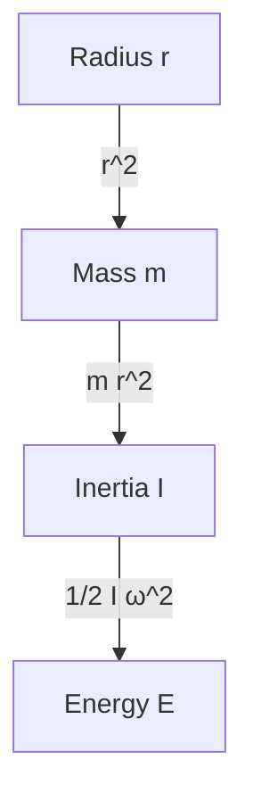
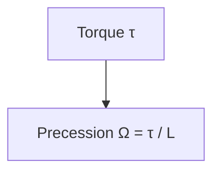
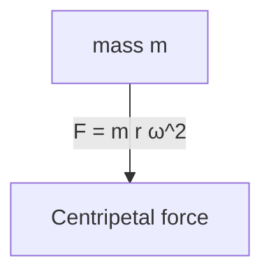
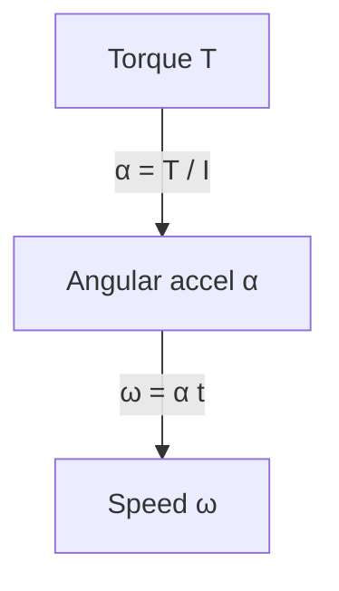
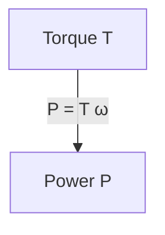

# Flywheel Physics

A spinning flywheel stores energy as rotational inertia.
This short explainer shows how to estimate that energy
and how GitHub renders formulas using LaTeX.

## Moment of inertia

For a solid cylinder,
$$I = \tfrac{1}{2} m r^2$$
where $m$ is mass and $r$ is radius.
Most flywheels include a bore for the shaft. Treating the wheel as a
thick-walled cylinder with inner radius $r_i$ and outer radius $r_o$ gives
$$I = \tfrac{1}{2} m (r_o^2 + r_i^2)$$
obtained by integrating the mass distribution:
$$
\begin{aligned}
I &= \int_{r_i}^{r_o} r'^2 (2\pi\rho h r'\,\mathrm{d}r') \\
  &= \tfrac{1}{2}\pi\rho h (r_o^4 - r_i^4) \\
  &= \tfrac{1}{2} m (r_o^2 + r_i^2)
\end{aligned}
$$
Here $m = \rho \pi h (r_o^2 - r_i^2)$ is the wheel's mass for density $\rho$ and height $h$.
Setting $r_i \to 0$ recovers the solid-disk formula, while the thin-rim limit
($r_i \approx r_o$) approaches $$I = m r_o^2,$$ doubling inertia for the same mass.

```mermaid
graph LR
    A[Solid disk] -->|I = 1/2 m r^2| B[Inertia]
    C[Thick wall] -->|I = 1/2 m (r_o^2 + r_i^2)| B
    D[Thin rim] -->|I = m r^2| B
```

Integrating the mass distribution shows where this expression comes from:

$$
\begin{aligned}
I &= \int_0^r r'^2\, \mathrm{d}m \\
  &= \int_0^r r'^2 (2\pi \rho h r'\, \mathrm{d}r') \\
  &= \tfrac{1}{2}\pi \rho h r^4 \\
  &= \tfrac{1}{2} m r^2
\end{aligned}
$$

where $\rho$ is the material density and $h$ the cylinder height.

## Stored energy

The kinetic energy of a rotating wheel is
$$E = \tfrac{1}{2} I \omega^2$$
with angular velocity $\omega$ in radians per second.
Expressed in revolutions per minute (rpm) $n$,
$$E = \tfrac{1}{2} I \left(\tfrac{2\pi n}{60}\right)^2 = \tfrac{\pi^2 I n^2}{1800}$$

### Example using CAD dimensions

The stock CAD model in [`cad/flywheel.scad`](../cad/flywheel.scad) sets
`diameter = 100` and `shaft_diameter = 10`, so $r_o = 50\,\text{mm}$,
$r_i = 5\,\text{mm}$ and $h = 20\,\text{mm}$. For material density $\rho$, the mass is

$$m = \rho\pi (r_o^2 - r_i^2) h$$

Converting the CAD dimensions to SI units gives
$r_o = 0.05\,\text{m}$, $r_i = 0.005\,\text{m}$ and $h = 0.02\,\text{m}$.
PLA has density $\rho \approx 1.25\,\text{g/cm}^3 = 1.25\times10^3\,\text{kg/m}^3$.
The volume is $V = \pi (r_o^2 - r_i^2) h \approx 1.6\times10^{-4}\,\text{m}^3$,
so the mass is $m \approx 0.19\,\text{kg}$.

Using the thick-walled formula,
$$I = \tfrac{1}{2} m (r_o^2 + r_i^2) \approx 2.5\times10^{-4}\,\text{kg·m}^2.$$
At 3000\,rpm the angular speed is $\omega = \tfrac{2\pi n}{60} \approx 314\,\text{rad/s}$,
so the wheel stores roughly $$E \approx 12\,\text{J}.$$

Actual mass varies with material density and print infill, so adjust $\rho$
to match your filament.

If the wheel were a thin rim of the same mass, the inertia would double:
$$I_{rim} = m r^2.$$

GitHub automatically displays these formulas when LaTeX expressions are wrapped
in dollar signs.

### Energy scaling with size

For a solid disk with density $\rho$ and height $h$, the inertia grows with the
fourth power of radius:

$$I = \tfrac{1}{2} \rho \pi r^4 h.$$

The stored energy therefore scales as

$$E = \tfrac{1}{4} \rho \pi r^4 h \omega^2.$$

Doubling the `diameter` in [`cad/flywheel.scad`](../cad/flywheel.scad) from
100\,mm to 200\,mm doubles the radius and multiplies the stored energy by 16 at
the same speed, while mass only quadruples. Increasing `height` scales mass and
energy linearly.



## Angular momentum and precession

The wheel's angular momentum is
$$L = I \omega$$
which resists changes in orientation. For the CAD dimensions above
($I \approx 2.5\times10^{-4}\,\text{kg·m}^2$) spinning at 3000\,rpm
($\omega \approx 314\,\text{rad/s}$) gives $L \approx 7.8\times10^{-2}\,\text{kg·m}^2/\text{s}$.

Torque is the time derivative of angular momentum,

$$\tau = \frac{\mathrm{d}L}{\mathrm{d}t}$$

so a force applied perpendicular to the spin axis changes the direction of $L$ rather than its magnitude.

An off-axis torque $\tau$ causes the spin axis to <!-- codespell:ignore precess -->precess at
$$\Omega = \frac{\tau}{L}$$
Perpendicular disturbances of $0.1\,\text{N·m}$ therefore produce
$$\Omega \approx \frac{0.1}{7.8\times10^{-2}} \approx 1.3\,\text{rad/s}$$
about $75^\circ/\text{s}$, which can twist the stand or mounts such as the one in
[`cad/stand.scad`](../cad/stand.scad).



## Rim speed and material limits

The rim's tangential velocity is
$$v = \omega r$$
where $r$ is the wheel radius.  Using the CAD value $r=50\,\text{mm}$ and
3000\,rpm ($\omega \approx 314\,\text{rad/s}$) gives $v \approx 16\,\text{m/s}$.  Plastic
parts have a maximum safe speed set by hoop stress.  Approximating the wheel as
a thin rim, balancing the centrifugal force $\rho A r \omega^2$ on a small
segment with the tensile stress $\sigma A$ it supports gives
$$\sigma \approx \rho r^2 \omega^2$$
with material density $\rho$ and yield strength $\sigma_y$.  Solving for the
upper speed limit,
$$\omega_{max} \approx \sqrt{\frac{\sigma_y}{\rho r^2}}$$
For PLA ($\rho \approx 1.25\,\text{g/cm}^3$, $\sigma_y \approx 60\,\text{MPa}$) and the
same radius, $\omega_{max} \approx 4.4\times10^3\,\text{rad/s}$ or about
42\,000\,rpm.  Designers typically apply a safety factor of at least two and
operate well below this bound.

Substituting this limit into the thin-rim energy expression
$$E = \tfrac{1}{2} m r^2 \omega^2$$
shows that material strength caps the stored energy at
$$E_{max} = \tfrac{\sigma_y}{2\rho} m$$
independent of radius. For the CAD wheel in [`cad/flywheel.scad`](../cad/flywheel.scad)
with $m \approx 0.19\,\text{kg}$, PLA allows roughly $E_{max} \approx 4.5\,\text{kJ}$
(about 4.5 kilojoules)—far above the $12\,\text{J}$ stored at 3000\,rpm.  Real prints
fail sooner from layer adhesion and voids, so treat this limit as a best-case upper
bound.

```mermaid
graph TD
    R[Radius r = 50 mm] --> V[v = ω r]
    R --> S[σ ≈ ρ r^2 ω^2]
    S --> W[ω_max = √(σ_y/(ρ r^2))]
```

## Rim acceleration

The rim experiences centripetal acceleration as it spins:
$$a = r \omega^2$$
With the CAD radius $r = 50\,\text{mm}$ and $\omega \approx 314\,\text{rad/s}$,
$$a \approx 5\times10^3\,\text{m/s}^2$$
which is roughly 500\,$g$.  Spokes and hubs must withstand this load to keep
the wheel intact.

The outward force on a rim segment of mass $m$ is

$$F = m a = m r \omega^2$$

For the CAD wheel in [`cad/flywheel.scad`](../cad/flywheel.scad), a
5\,g screw near the edge sees roughly
$$F \approx 5\times10^{-3} \times 0.05 \times 314^2 \approx 25\,\text{N}$$
at 3000\,rpm, so even small fixtures need secure retention.



## Spin-up time

A constant torque $T$ causes angular acceleration $\alpha$ according to

$$\alpha = \frac{T}{I}$$

Starting from rest, the time to reach speed $\omega$ is therefore

$$t = \frac{\omega}{\alpha} = \frac{I\omega}{T}$$

Rearranging for torque gives

$$T = \frac{I\omega}{t}$$

Spinning the CAD wheel to 3000\,rpm in 0.5\,s therefore needs roughly
$$T \approx \frac{2.5\times10^{-4} \times 314}{0.5} \approx 0.16\,\text{N·m}.$$



Using the same CAD dimensions as above ($I \approx 2.5\times10^{-4}\,\text{kg·m}^2$),
a modest $0.5\,\text{N·m}$ motor torque spins the wheel to
3000\,rpm ($\omega \approx 314\,\text{rad/s}$) in about $t \approx 0.16\,\text{s}$.

The work required is $W = \tfrac{1}{2} I \omega^2$.  Constant torque means the
instantaneous power is $P = T\omega$, rising linearly with speed.  For the
[`cad/flywheel.scad`](../cad/flywheel.scad) example, power peaks near
$P \approx 0.5\times314 \approx 160\,\text{W}$ at 3000\,rpm.

## Power requirements

Torque and angular velocity set the instantaneous mechanical power:

$$P = T\omega$$

With the CAD model in [`cad/flywheel.scad`](../cad/flywheel.scad) the example torque
$T = 0.5\,\text{N·m}$ at 3000\,rpm ($\omega \approx 314\,\text{rad/s}$) requires

$$P \approx 0.5 \times 314 \approx 1.6\times10^2\,\text{W}.$$
The average power over the $t \approx 0.16\,\text{s}$ spin-up interval is

$$P_{avg} = \frac{E}{t} = \frac{\tfrac{1}{2} I \omega^2}{t} \approx \frac{12}{0.16}
\approx 75\,\text{W}.$$
Sizing a motor or crank becomes easier when both peak and average power are known.



## Spin-down from friction

Even unloaded, bearing and air drag slowly bleed energy from the wheel. Approximating a
constant friction torque $T_f$ gives the angular deceleration

$$\alpha = -\frac{T_f}{I}$$

so the angular speed falls linearly:
$$\omega(t) = \omega_0 - \frac{T_f}{I} t$$
and the coasting time from speed $\omega_0$ to rest is

$$t = \frac{I\omega_0}{T_f}$$

The stand in [`cad/stand.scad`](../cad/stand.scad) holds standard 608 bearings (22\,mm outer
diameter, 7\,mm thick) around the 8\,mm shaft from
[`cad/shaft.scad`](../cad/shaft.scad).  A typical 608 bearing produces
$T_f \approx 10^{-3}\,\text{N·m}$, so the example wheel ($I \approx
2.5\times10^{-4}\,\text{kg·m}^2$) coasts from 3000\,rpm ($\omega_0 \approx
314\,\text{rad/s}$) for roughly $t \approx 80\,\text{s}$.

The total angle swept during this coast is
$$\theta = \tfrac{1}{2} \omega_0 t = \tfrac{I \omega_0^2}{2 T_f}$$
For the same parameters this works out to $\theta \approx 1.2\times10^4$ rad,
about $2\times10^3$ revolutions, so ensure the stand clears neighboring parts.

Speed falls linearly as $\omega(t) = \omega_0 - (T_f/I) t$.  Friction converts
mechanical energy to heat at rate $P = T_f \omega$, about
$0.3\,\text{W}$ for the same bearing and speed.

## Forces on the adapter

When you spin the wheel, torque $T$ from the motor or handle acts on the
adapter. If the adapter slips, the wheel will not accelerate. Approximate the
shear stress on the clamp as
$$\tau \approx \frac{T}{r A}$$
where $r$ is the shaft radius and $A$ is the contact area.

Choose an adapter material with yield strength safely above $\tau$.
Nylon or metal inserts work for higher torques, while PETG suffices for lighter loads.

Tightening the bolts increases normal force $F_n$ on the shaft.
Friction then resists the twisting force:
$$T_{max} = \mu F_n r$$
with friction coefficient $\mu$ around 0.2--0.3 for plastic on steel.
Use stronger bolts or more clamp area if you need higher torque capacity.

For the adapter in [`cad/adapter.scad`](../cad/adapter.scad) the shaft diameter
is $8\,\text{mm}$ and the clamping length is $20\,\text{mm}$.  The contact area
is therefore $A \approx \pi d h \approx 5\times10^{-4}\,\text{m}^2$.  Under a
$5\,\text{N·m}$ torque the shear stress is about
$$\tau \approx \frac{5}{0.004\times 5\times10^{-4}} \approx 2.5\,\text{MPa},$$
well below the $40\,\text{MPa}$ yield strength of many nylon inserts.

## Multi-flywheel systems

Multiple wheels can be coupled together when a single flywheel does not
provide enough energy storage.  Belts, chains, or gears transfer torque
from one shaft to the next.  Assuming negligible losses, the ratio of
angular velocities in a belt drive is given by

$$\omega_2 = \frac{r_1}{r_2} \omega_1$$

where $r_1$ and $r_2$ are the radii of the driving and driven pulleys.
Gears follow the same relation using tooth counts instead of radii.

The total stored energy is simply the sum of each wheel's kinetic
energy:

$$E_{total} = \tfrac{1}{2} I_1 \omega_1^2 + \tfrac{1}{2} I_2 \omega_2^2 + \cdots$$

Connecting flywheels lets you trade off space, weight, and speed.  A
small high-speed wheel might feed power into a larger, slower wheel to
smooth out fluctuations.  Keep belt tension high enough to avoid slip
and align pulleys carefully so side loads do not wear the bearings.

Belt drives obey the tension ratio
$$\frac{T_1}{T_2} = e^{\mu \theta}$$
where $T_1$ is the tight-side tension, $T_2$ the slack side tension,
$\mu$ the coefficient of friction, and $\theta$ the wrap angle in radians.
This sets the maximum torque each belt can transmit.


As an example, a 200\,mm wheel driving a 50\,mm pulley quadruples the speed.
Linking that smaller pulley to a third wheel can multiply storage while
keeping the overall setup compact.
Gears or chains work similarly but eliminate belt slip at the cost of more
noise and alignment care.
